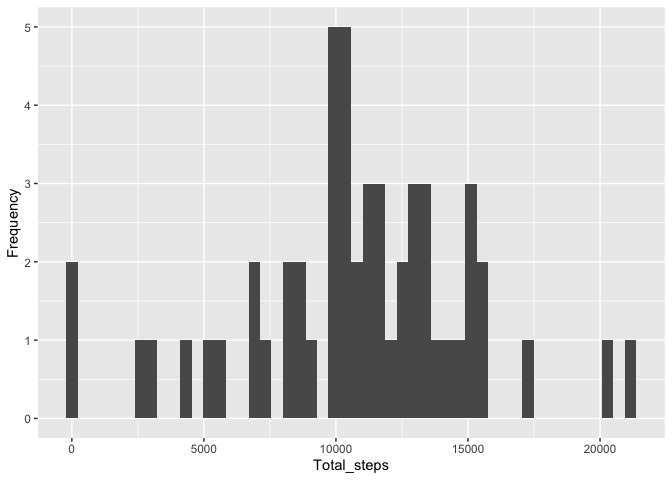
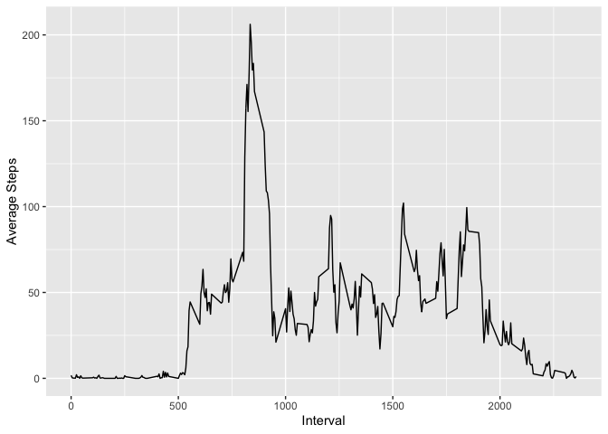
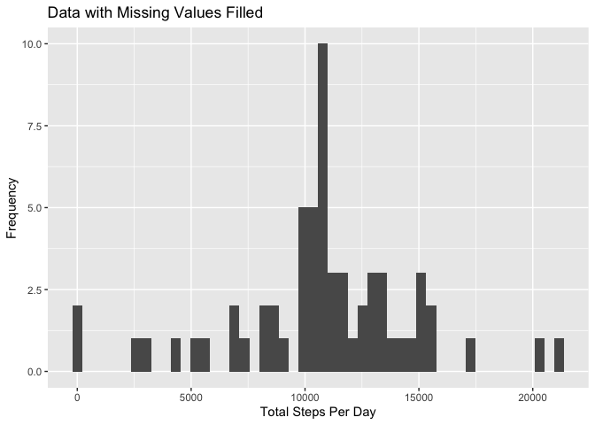
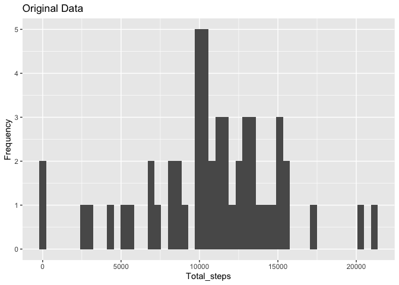
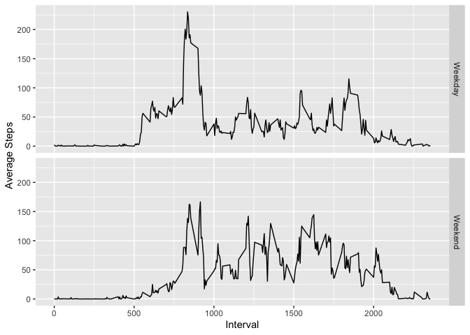

## Loading and preprocessing the data
(Assuming that the csv file is stored in working directory)


```r
activity <- read.csv("activity.csv")
activity$date <- as.Date(activity$date, "%Y-%m-%d")
```


## What is mean total number of steps taken per day?

### 1. Calculate the total number of steps taken per day


```r
activity_sum <- aggregate(activity$steps, by = list(activity$date), FUN = sum)
names(activity_sum) <- c("Date", "Total_steps")
head(activity_sum)
```

```
##         Date Total_steps
## 1 2012-10-01          NA
## 2 2012-10-02         126
## 3 2012-10-03       11352
## 4 2012-10-04       12116
## 5 2012-10-05       13294
## 6 2012-10-06       15420
```

### 2. Make a histogram of the total number of steps taken each day


```r
library(ggplot2)

plot1 <- ggplot(data = activity_sum, aes(Total_steps)) +
  geom_histogram(bins = 50) + ylab("Frequency")
print(plot1)
```

```
## Warning: Removed 8 rows containing non-finite values (stat_bin).
```

<!-- -->

### 3. Calculate and report the mean and median of the total number of steps taken per day


```r
ts_mean <- mean(activity_sum$Total_steps, na.rm = TRUE)
ts_median <- median(activity_sum$Total_steps, na.rm = TRUE)
print(ts_mean)
```

```
## [1] 10766.19
```

```r
print(ts_median)
```

```
## [1] 10765
```

Mean total steps per day:  10766.1886792453
Median total steps per day:  10765


## What is the average daily activity pattern?

### 1. Make a time series plot (i.e. type="l") of the 5-minute interval (x-axis) and the average number of steps taken, averaged across all days (y-axis)


```r
act_int_mean <- aggregate(activity$steps, by = list(activity$interval), FUN = mean, na.rm = TRUE)
names(act_int_mean) <- c("Interval", "Avg_steps")

plot2 <- ggplot(data = act_int_mean, aes(Interval, Avg_steps)) +
  geom_line() + ylab("Average Steps")

print(plot2)
```

<!-- -->

### 2. Which 5-minute interval, on average across all the days in the dataset, contains the maximum number of steps?


```r
row_num <- which.max(act_int_mean$Avg_steps)
int_max <- act_int_mean$Interval[row_num]
print(int_max)
```

```
## [1] 835
```

Interval 835 contains maximum average steps.


## Imputing missing values

### 1. Calculate and report the total number of missing values in the dataset (i.e. the total number of rows with NAs.


```r
sum(is.na(activity[1]))
```

```
## [1] 2304
```

```r
sum(is.na(activity))
```

```
## [1] 2304
```
Above are number of NA's in the steps variable and the entire activity dataset. Because they are same, we know that only the step variable contains missing values.


### 2. Devise a strategy for filling in all of the missing values in the dataset. The strategy does not need to be sophisticated. For example, you could use the mean/median for that day, or the mean for that 5-minute interval, etc.

I chose to subsitute NA's with the average steps of that interval, utilizing the act_int_mean data frame that's created in previous part. Below is my way (find row# with missing steps -> find interval matched to that row# -> find average steps matched to that interval in act_int_mean data -> assign average steps to the activit dataset). It might also worth trying the dplyr package, but I didn't know how to. 

### 3. Create a new dataset that is equal to the original dataset but with the missing data filled in.


```r
# fill missing value with interval average value:

activity2 <- activity
NArows <- which(is.na(activity2$steps))
i <- 1:nrow(activity2) # not sure if pre-assigning value to i is necessary...

for (i in NArows) {
  Int <- activity2[i,]$interval 
  meanstep <- act_int_mean[act_int_mean$Interval == Int,]$Avg_steps
  activity2[i,]$steps <- meanstep
}

head(activity2)
```

```
##       steps       date interval
## 1 1.7169811 2012-10-01        0
## 2 0.3396226 2012-10-01        5
## 3 0.1320755 2012-10-01       10
## 4 0.1509434 2012-10-01       15
## 5 0.0754717 2012-10-01       20
## 6 2.0943396 2012-10-01       25
```

```r
sum(is.na(activity2))
```

```
## [1] 0
```

Now there's 0 NA's remain the activity2 dataset.


### 4. Make a histogram of the total number of steps taken each day and Calculate and report the mean and median total number of steps taken per day. Do these values differ from the estimates from the first part of the assignment? What is the impact of imputing missing data on the estimates of the total daily number of steps?


```r
library(ggplot2)

activity2_sum <- aggregate(activity2$steps, by = list(activity2$date), FUN = sum)
names(activity2_sum) <- c("Date", "Total_steps")

plot3 <- ggplot(data = activity2_sum, aes(Total_steps)) + geom_histogram(bins = 50) + xlab("Total Steps Per Day") + ylab("Frequency") + ggtitle("Data with Missing Values Filled")
print(plot3)
```

<!-- -->

Below is plot1 again:


```r
print(plot1 + ggtitle("Original Data")) 
```

```
## Warning: Removed 8 rows containing non-finite values (stat_bin).
```

<!-- -->

Although filling missing data increased total steps per day overall, trend of distribution was not changed between the two plots. 


```r
ts_mean2 <- mean(activity2_sum$Total_steps, na.rm = TRUE)
ts_median2 <- median(activity2_sum$Total_steps, na.rm = TRUE)
print(ts_mean2)
```

```
## [1] 10766.19
```

```r
print(ts_median2)
```

```
## [1] 10766.19
```
Mean total steps per day:  10766.19
Median total steps per day:  10766.19


## Are there differences in activity patterns between weekdays and weekends?


### 1. Create a new factor variable in the dataset with two levels – “weekday” and “weekend” indicating whether a given date is a weekday or weekend day.


```r
library(dplyr)
```

```
## 
## Attaching package: 'dplyr'
```

```
## The following objects are masked from 'package:stats':
## 
##     filter, lag
```

```
## The following objects are masked from 'package:base':
## 
##     intersect, setdiff, setequal, union
```

```r
activity3 <- mutate(activity2, weekday = weekdays(activity$date))

Weekday <- c("Monday", "Tuesday", "Wednesday", "Thursday", "Friday")
Weekend <- c("Saturday", "Sunday")

activity3 <- mutate(activity3, Weekday_type = ifelse(weekday %in% Weekday, "Weekday", "Weekend"))

head(activity3)
```

```
##       steps       date interval weekday Weekday_type
## 1 1.7169811 2012-10-01        0  Monday      Weekday
## 2 0.3396226 2012-10-01        5  Monday      Weekday
## 3 0.1320755 2012-10-01       10  Monday      Weekday
## 4 0.1509434 2012-10-01       15  Monday      Weekday
## 5 0.0754717 2012-10-01       20  Monday      Weekday
## 6 2.0943396 2012-10-01       25  Monday      Weekday
```

Now 2 variables, weekday (Monday through Sunday), and Weekday_type (Weekday or Weekend) are added in the new dataset.


### 2. Make a panel plot containing a time series plot (type="l") of the 5-minute interval (x-axis) and the average number of steps taken, averaged across all weekday days or weekend days (y-axis). See the README file in the GitHub repository to see an example of what this plot should look like using simulated data.


```r
# Created a data frame of average steps based on both interval and weekday type:
act_int_mean2 <- aggregate(steps ~ interval + Weekday_type, data = activity3, mean)
names(act_int_mean2) <- c("Interval", "Weekday_type", "Avg_steps")

# Plot:
plot4 <- ggplot(act_int_mean2, aes(Interval, Avg_steps)) + geom_line() + facet_grid(Weekday_type ~ .) + ylab("Average Steps")

print(plot4)
```

<!-- -->

Steps on weekends are more evenly distributed during the day than the weekday, 

Note that per instruction, dataset with filled in missing values was used. Since the filled in values are the overall interval means, they do not differ between weekdays and weekends. Recalculating these values based on weekdays may help the differences show better.    


